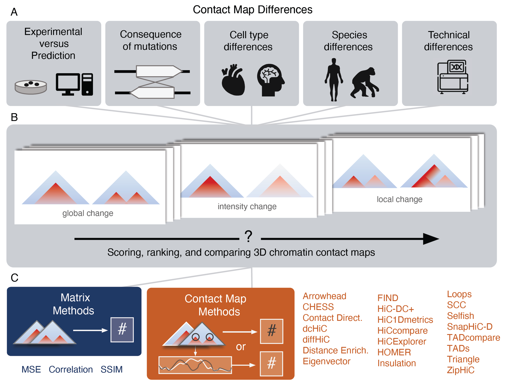

# Comparing chromatin contact maps at scale: methods and insights

Preprint link: https://www.biorxiv.org/content/10.1101/2023.04.04.535480v1

In this repo, you can find:
- [Code](https://github.com/pollardlab/contact_map_scoring/blob/main/code/scoring.py) and [Tutorials](https://github.com/pollardlab/contact_map_scoring/tree/main/notebooks) for running scoring methods on both experimental and predicted contact frequency maps.
- [Dataset](https://github.com/pollardlab/contact_map_scoring/tree/main/data) of:
	* Scores for _in silico_ insertions and deletions throughout the genome
	* Scores comparing windows around differentially expressed genes between ESC and HFF in chromosomes 21 and 22




## Running scoring functions


Download this repo:
```
git clone https://github.com/pollardlab/contact_map_scoring.git
```

We provide scripts to run all 25 scoring functions on experimental maps. Since they vary in input type and coding language, they are split into multiple scripts as follows:


### Methods that use contact maps

Methods that take in matrices that correspond to contact frequency maps of a certain region. This includes the following 13 methods:
- Correlation
- MSE
- SSIM
- Contact directionality (corr)
- Distance enrichment (corr)
- Eigenvector (corr)
- Insulation (corr)
- Insulation (mse)
- Loops
- SCC
- TADs
- Triangle (corr)
- Triangle (mse)

#### Script
[code/run_methods_that_use_contact_maps.py](https://github.com/pollardlab/contact_map_scoring/blob/main/code/run_methods_that_use_contact_maps.py)


#### Installation requirements
- scipy: for Correlation, Contact directionality (corr), Distance enrichment (corr), Eigenvector (corr), Insulation (corr), SCC, and Triangle (corr)
- skimage: for Contact directionality (corr), SSIM, Triangle (corr), and Triangle (mse)
- sklearn: for Eigenvector only
- cooltools: for TADs only
- hicrep: for SCC only


#### Directions
- Generate input files outlined below
- Change variables in the script following instructions there
- Run script in the terminal
```
python run_methods_that_use_contact_maps.py
````

To run these methods on predicted maps instead of experimental ones, follow instructions in [Running_Scoring_Functions_on_Predicted_Maps.ipynb](https://github.com/pollardlab/contact_map_scoring/tree/main/notebooks/Running_Scoring_Functions_on_Predicted_Maps.ipynb)


#### Input
1. Windows to score. This should be a tab-delimited text file with columns: chrom, start, end.
2. Two cool files that will be compared at provided windows.


#### Output 
Tab-delimited text file with the same rows as the input windows file and added columns with scores for each method.


### TADcompare and HiCcompare

#### Script
[code/run_tad_hic_compare.R](https://github.com/pollardlab/contact_map_scoring/blob/main/code/run_tad_hic_compare.R)


#### Installation requirements
- [TADcompare](https://bioconductor.org/packages/release/bioc/vignettes/TADCompare/inst/doc/TADCompare.html#installation)
- [HiCcompare](https://github.com/dozmorovlab/HiCcompare?tab=readme-ov-file#installation)


#### Directions
- Generate input files following instructions below
- Change variables in the script following instructions there
- Run script in the terminal
```
Rscript run_tad_hic_compare.R
````

#### Input
Two chromosome-specific text files generated from cool files. Input file format: {input_file_prefix}_{experiment}_{chromosome}_{resolution}.txt

Example of generating chromosome-specific text file for:
- input_file_prefix: example_cool
- experiment: MicroC
- chromosome: chr21
- resolution: 2048

1. Create chromosome-wide text file from cool file:
```
cooler dump --join example_cool_MicroC.mcool::/resolutions/2048 > example_cool_MicroC_2048.txt
```

2. Create chromosome-specific text file from chromosome-wide text file:
```
awk -F '\t' '$1 == "chr21"{ print }' example_cool_MicroC_2048.txt > example_cool_MicroC_chr21_2048.txt
```


#### Output 
Tab-delimited text files with results for each method, experiment, chromosome, and resolution saved in a new directory created separately for HiC compare and TADcompare


### dcHiC

#### Script
[code/run_dcHiC.sh](https://github.com/pollardlab/contact_map_scoring/blob/main/code/run_dcHiC.sh)


#### Installation requirements
- [dcHiC] (https://github.com/ay-lab/dcHiC)

#### Directions
Directions for running the dcHiC script can be printed with the help flag:
```
sh run_dcHiC.sh --h
```

Example of running dcHiC on MicroC data between ESC and HFF at 2,048 bp resolution in 1 Mb example windows:
```
sh run_dcHiC.sh \
-C ../data/experimental_maps/ESC_MicroC.mcool \
-c ../data/experimental_maps/HFF_MicroC.mcool \
-r ../data/experimental_maps/example_DEG_windows_noheader.bed \
-P ESC_MicroC \
-p HFF_MicroC \
-g ../data/GRCh38_EBV_norandom_noEBV.chrom.sizes \
-b 2048 \
-o ../data/experimental_maps/scores/dcHiC_scores \
-d softwares/dcHiC
```

#### Input
The following files are necessary for running dcHiC:
- Two genome-wide contact map in .mcool format 
- A file with windows of interest without a header and with columns: chrom, start, end 


#### Output 
Tab-delimited text files with scores for each provided genomic window in columns: dcHiC_mse, dcHiC_pearson, dcHiC_spearman.


### Selfish

#### Script
[code/run_selfish.sh](https://github.com/pollardlab/contact_map_scoring/blob/main/code/run_selfish.sh)

#### Installation requirements

- [Selfish] (https://github.com/ay-lab/selfish)

#### Directions
- Change variables in the script following instructions there
- Run script in the terminal
```
sh run_selfish.sh
```

#### Input
The following files are necessary for running Selfish:
- Two genome-wide contact map in .mcool format 
- A file with windows of interest without a header and with columns: chrom, start, end 

#### Output 
Tab-delimited text files with the number of differential chromatin interactions between the two contact maps for each provided genomic window.


### Arrowhead

#### Script
[code/run_Arrowhead.sh](https://github.com/pollardlab/contact_map_scoring/blob/main/code/run_Arrowhead.sh)

#### Installation requirements

- [Arrowhead] (https://github.com/aidenlab/juicer/wiki/Installation)

#### Directions
- Change variables in the script following instructions there
- Run script in the terminal
```
sh run_Arrowhead.sh
```
#### Input
The following files are necessary for running Arrowhead:
- Two genome-wide contact map in .hic format 
- A file with windows of interest without a header and with columns: chrom, start, end 

#### Output 
Tab-delimited text files with the TADs shared (within 20kb), gained or lost between two contact maps for each provided genomic window and the corresponding ratio.

### CHESS

#### Script
[code/run_chess.sh](https://github.com/pollardlab/contact_map_scoring/blob/main/code/run_chess.sh)

#### Installation requirements

- [CHESS] (https://chess-hic.readthedocs.io/en/latest/installation.html)

#### Directions
Directions for running the CHESS script can be printed with the help flag:
```
sh run_chess.sh --h
```

Example of running CHESS on MicroC data between ESC and HFF at 2,048 bp resolution in 1 Mb example windows:
```
sh run_chess.sh \
-C ../data/experimental_maps/ESC_MicroC.mcool \
-c ../data/experimental_maps/HFF_MicroC.mcool \
-R ../data/experimental_maps/example_DEG_windows.bedpe \
-b 2048 \
-t 8 \
-o ESC_vs_HFF
```

#### Input
The following files are necessary for running CHESS:
- Two genome-wide contact map in .mcool format 
- A file with windows of interest in bedpe format and with columns: chrom1 start1 end1 chrom2 start2 end2 name score strand1 strand2.


#### Output 
Tab-delimited text files with scores for each provided genomic window in columns: SN, ssim, z_ssim (only ssim scores were used in our downstream analysis).

### HiC1Dmetrics

#### Script
[code/run_HiC1Dmetrics.py](https://github.com/pollardlab/contact_map_scoring/blob/main/code/run_HiC1Dmetrics.py)

#### Installation requirements

- [HiC1Dmetrics] (https://h1d.readthedocs.io/en/latest/overview.html)

#### Directions
Directions for running the HiC1Dmetrics script can be printed with the help flag:
```
python run_HiC1Dmetrics.py -h
```
Example of running HiC1Dmetrics on MicroC data between ESC and HFF at 2,048 bp resolution in 1 Mb example windows:
```
python run_HiC1Dmetrics.py \
-f ../data/experimental_maps/ESC_MicroC.mcool \
-s ../data/experimental_maps/HFF_MicroC.mcool \
-i ../data/experimental_maps/example_DEG_windows \
-a ESC
-b HFF 
-r 2048 \
-c chr21
-n 8 \
-o ../data/experimental_maps/scores/HiC1Dmetrics_scores
```

#### Input
The following files are necessary for running HiC1Dmetrics:
- Two genome-wide contact map in .mcool format 
- A file with windows of interest with a header and with columns: chrom, start, end.


#### Output 
Tab-delimited text files with scores for each provided genomic window in columns: ISC, CIC, SSC, deltaDLR, CD (HiC1Dmetrics).


## Contact

Please contact raise an issue on this repo or email us `{laura.gunsalus, evonne.mcarthur}@gmail.com`) if you have any questions or concerns.
