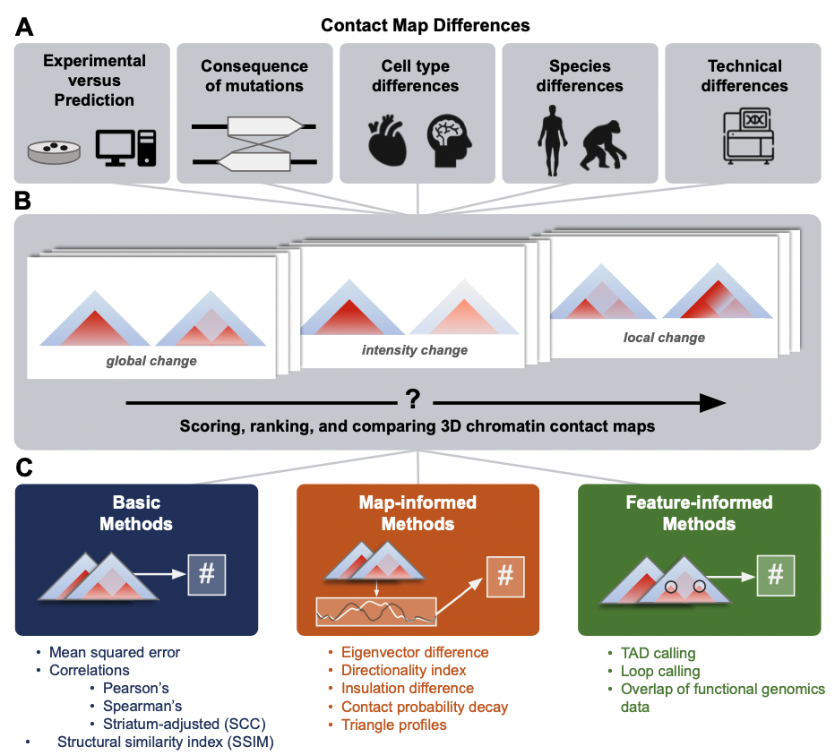

# Comparing chromatin contact maps at scale: methods and insights

Preprint link: https://www.biorxiv.org/content/10.1101/2023.04.04.535480v1

In this repo, you can find:
- Scoring code for basic, map-motivated, and feature-motivated scoring methods.
- Tutorials for running code on Hi-C contact maps.
- Dataset of scored _in silico_ insertions and deletions. 

## Contact

Please contact raise an issue on this repo or email us `{laura.gunsalus, evonne.mcarthur}@gmail.com`) if you have any questions or concerns.